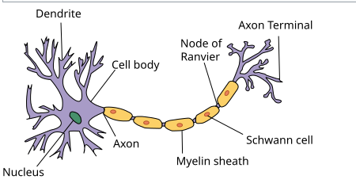

# 🧠 Understanding Basic Neuroscience 

**Date:** October 2025  
**Topic:** Neurons, Action Potential & Syanpses  

---

## ⚙️ What Are Neurons?

Neurons are **complex electrochemical devices** that:
- Receive input from hundreds of other neurons  
- Process that information  
- Transmit output signals to connected neurons  

Think of them as **tiny biological processors** — or “leaky bags of charged liquid” — constantly balancing ions to create electrical activity.

*Image source: Wikimedia Commons — ["Neuron structure"](https://commons.wikimedia.org/wiki/File:Neuron.svg),  
licensed under [CC BY-SA 3.0](https://creativecommons.org/licenses/by-sa/3.0/).*

---

## ⚡ Ionic Composition & Resting Potential  

The neuron’s **membrane** is made of a **lipid bilayer**, which is impermeable to most ions and water.  
It has **ion channels** that selectively allow the passage of certain charged particles.

| Inside the Neuron | Outside the Neuron |
|--------------------|--------------------|
| High **Potassium (K⁺)** | High **Sodium (Na⁺)** |
| High **Anions (A⁻)** | High **Chloride (Cl⁻)** |
| — | High **Calcium (Ca²⁺)** |

Because of this **ion imbalance**, a potential difference of about **–65 mV to –70 mV** exists across the membrane when the neuron is at rest — called the **Resting Membrane Potential**.

*Figure: Ionic Channels redrawn by Vaishnavi Gawale,  
based on "Brain-Computer Interfacing: An Introduction" by Rajesh P. N. Rao (2013).*

---

## ⚡ Action Potential — The Electrical Impulse  

When a neuron receives a **strong input**, it fires an **action potential (spike)**:  
1. **Sodium (Na⁺)** ions rush **into** the cell.  
2. The **membrane potential rises sharply** (depolarization).  
3. **Potassium (K⁺)** ions flow **out**, restoring the potential (repolarization).  

This rapid rise and fall of voltage is how neurons **send electrical signals**, the core mechanism of communication in the brain.

---

## 🌳 Dendrites, Axons, & Soma  

A typical neuron consists of:
- **Soma (Cell Body):** The control center that contains the nucleus.  
- **Dendrites:** Branch-like structures that **receive signals** from other neurons.  
- **Axon:** A single long projection that **sends output spikes** to other neurons.  

Most axons are covered by a **myelin sheath** — an insulating layer that **boosts spike propagation speed** over long distances.

---

## 🔗 Synapses — Neural Connections  

Neurons communicate through specialized junctions called **synapses**.  
They can be:
- **Electrical synapses:** Direct, rapid connections.  
- **Chemical synapses:** More common, using neurotransmitters that cross a tiny **synaptic cleft**.

### 🟢 Excitatory Synapses
- Increase the postsynaptic membrane potential  
- Produce **EPSPs (Excitatory Postsynaptic Potentials)**  
- Make the neuron **more likely to fire**

### 🔴 Inhibitory Synapses
- Decrease the postsynaptic membrane potential  
- Produce **IPSPs (Inhibitory Postsynaptic Potentials)**  
- Make the neuron **less likely to fire**

Each neuron forms **only one type of synapse** — excitatory or inhibitory.

*Figure: Synapses redrawn by Vaishnavi Gawale,  
based on "Brain-Computer Interfacing: An Introduction" by Rajesh P. N. Rao (2013).*

---

## 💥 Spike Generation  

A neuron constantly integrates excitatory and inhibitory inputs.  
When its membrane potential **crosses the threshold**, a **spike** (action potential) is emitted.  

This makes neurons **hybrid analog–digital computing devices**:
- **Analog** when summing continuous inputs  
- **Digital** when firing discrete spikes  

---

## 🔄 Synaptic Plasticity — Learning & Adaptation  

**Synaptic plasticity** is the ability of synapses to **strengthen or weaken** over time, depending on activity.  
It forms the biological basis of **learning and memory**.

### ⏱️ Short-Term Plasticity (STP)
- Lasts **milliseconds to minutes**
- Involves **temporary facilitation or depression**

### 🧩 Long-Term Plasticity (LTP & LTD)
- Lasts **hours to days**
- **LTP (Long-Term Potentiation):** Strengthening due to repeated activation  
  - “Neurons that fire together, wire together.”  
- **LTD (Long-Term Depression):** Weakening due to uncorrelated or reduced activity  

### ⏳ Spike-Timing-Dependent Plasticity (STDP)
- **Timing** between pre- and post-synaptic spikes matters:
  - Pre-spike **before** post-spike → synapse **strengthens**  
  - Pre-spike **after** post-spike → synapse **weakens**  

---

## 🧬 Summary  

- **Neurons** are electrical and chemical messengers of the brain.  
- **Action potentials** transmit information as spikes.  
- **Synapses** connect and coordinate communication.  
- **Plasticity** enables learning and memory through adaptive change.  

Together, these mechanisms form the foundation of how the brain **computes, learns, and adapts** — the very principles behind **Brain-Computer Interfaces (BCI)**.

---

## 📚 References  

Rao, Rajesh P. N. *Brain-Computer Interfacing: An Introduction.*  
Cambridge University Press, 2013.

> Note: This blog summarizes concepts from the book “Brain-Computer Interfacing: An Introduction” by Rajesh P. N. Rao (Cambridge University Press, 2013). The content has been paraphrased and reorganized for educational and learning purposes.
